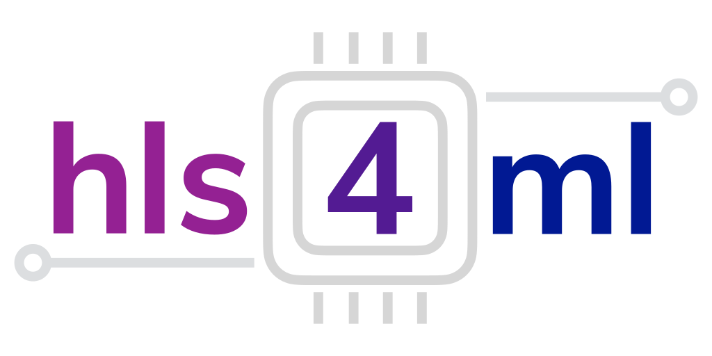
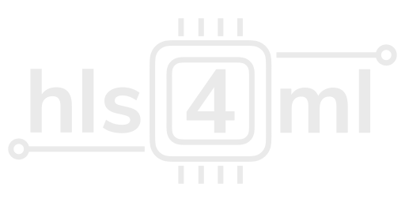

# hls4ml Logo 
This directory contains the hls4ml logo in PNG and SVG format, with a color version (`hls4ml_logo.***`) and a greyscale/single color version (`hls4ml_logo_lightgrey.***`)

## Color Version
PNG: 
SVG: 
## Greyscale/Single Color Version
PNG: 
SVG: 

## Font Used
The font used in the logo is [Nunito Sans (Bold) by Vernon Adams](https://fonts.adobe.com/fonts/nunito-sans)
(In the logo file itself, the text glyphs have been converted to paths, so the font is **not** required to be installed/included to display it properly)
